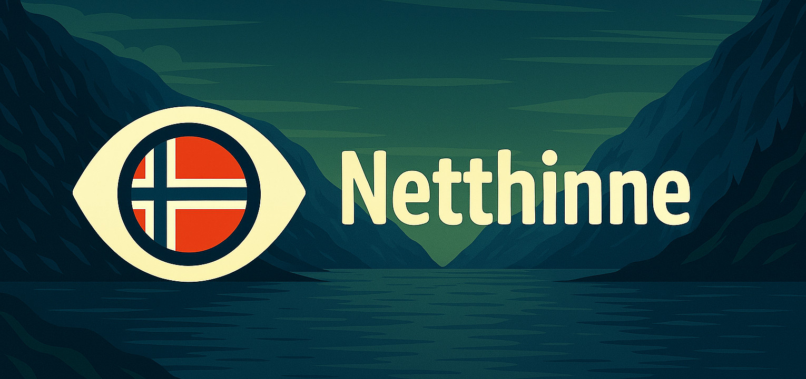

  

  <h1>Netthinne: Camera-based object recognition with Norwegian translation</h1>

Netthinne is a small personal web app that runs entirely in the browser. Point the camera at any object, press the shutter, and the app tells you what it sees in English and Norwegian. It is a learning aid for my own journey with the language.

## How it works

The app is built with [Dioxus](https://dioxuslabs.com/), a Rust framework for building reactive web interfaces that compile to WebAssembly. There is no backend. Everything (UI, the image processing, and the model inference) runs client-side.

Inference is handled by [Burn](https://burn.dev/), a Rust deep learning framework. A pre-trained ONNX model is compiled directly into the WebAssembly binary at build time using `burn-onnx`, so the app ships as a single self-contained bundle with no server calls at inference time.

This adds a constraint in model size, which impacts accuracy. So expect some unexpected classifications.

When a photo is taken, the raw camera frame is preprocessed in Rust (resized, normalized, and laid out in the tensor format the model expects) before being fed to the model. The predicted class is looked up in a bilingual label list and both the English and Norwegian names are shown.

## Goal

This project exists to support a personal learning goal. Seeing the Norwegian name for everyday objects immediately after pointing a camera at them is a simple but effective way to build vocabulary.
